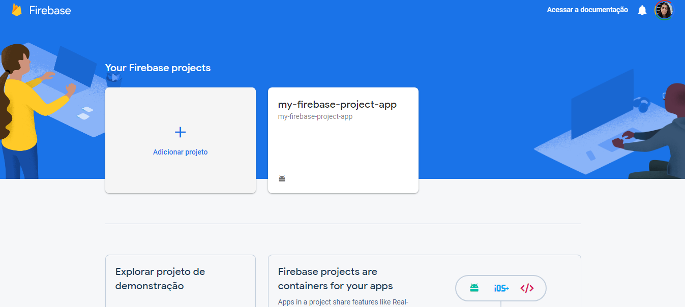

# How To Connect Firebase On Application Flutter

---

## First Step - Create A Flutter Application

> Add into Firebase account a new project



> Named a Project


> Select Account


> Wait For Project Creation 


> Now I go create a new application


> Get the package name of application


> Add Firebase into app


> To generate the SHA-1 Key (Serves for several google services, such as login)

```powershell
cd C:\Program Files\Android\Android Studio\jre\bin

keytool -list -v -keystore "%USERPROFILE%\.android\debug.keystore" -alias androiddebugkey -storepass android -keypass android
```

> Then copy the key that will be generated and paste it in the field

> Inside the App Save the services.json file


> Adding the Firebase SDK


> Adding the google service dependency


> Adding the plugin and dependency


### Settings


### CRUD Sample

[my_flutter_sample/crud_firebase_project_app at main · miguelhp373/my_flutter_sample](https://github.com/miguelhp373/my_flutter_sample/tree/main/crud_firebase_project_app)